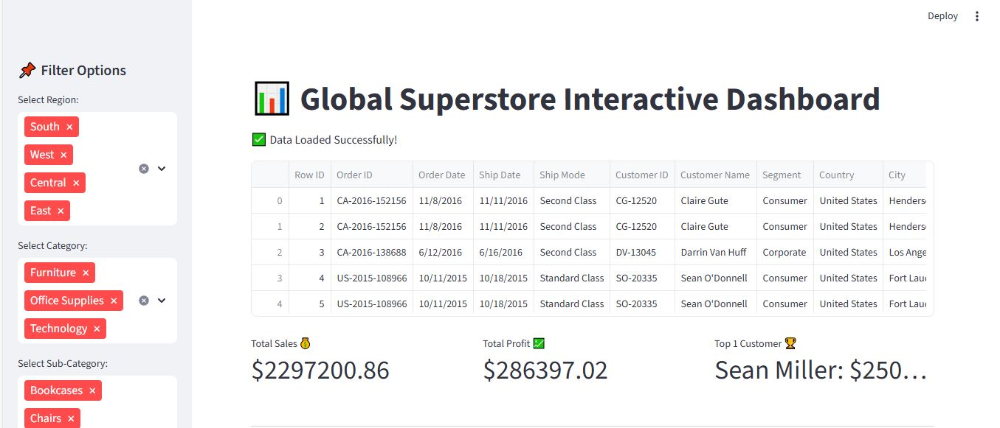
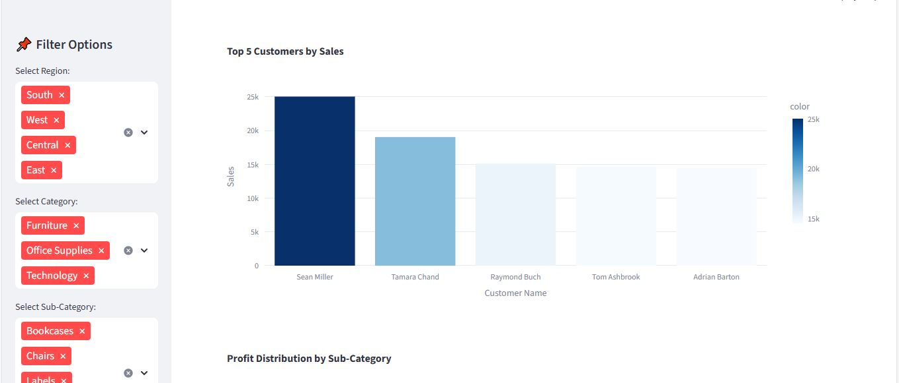
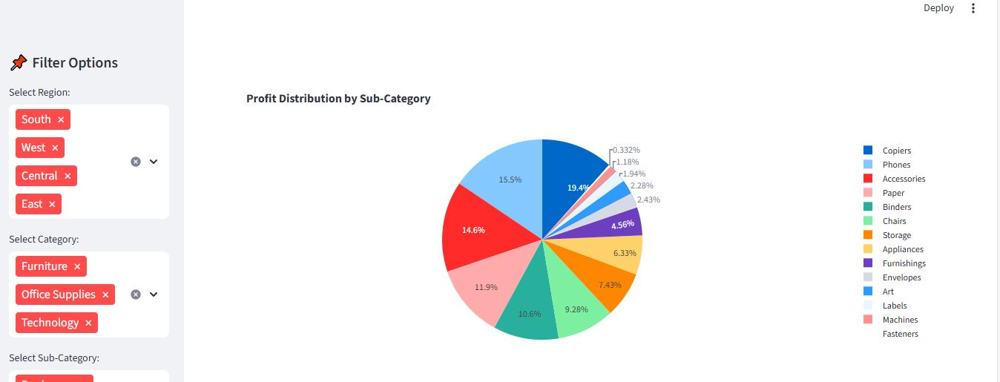
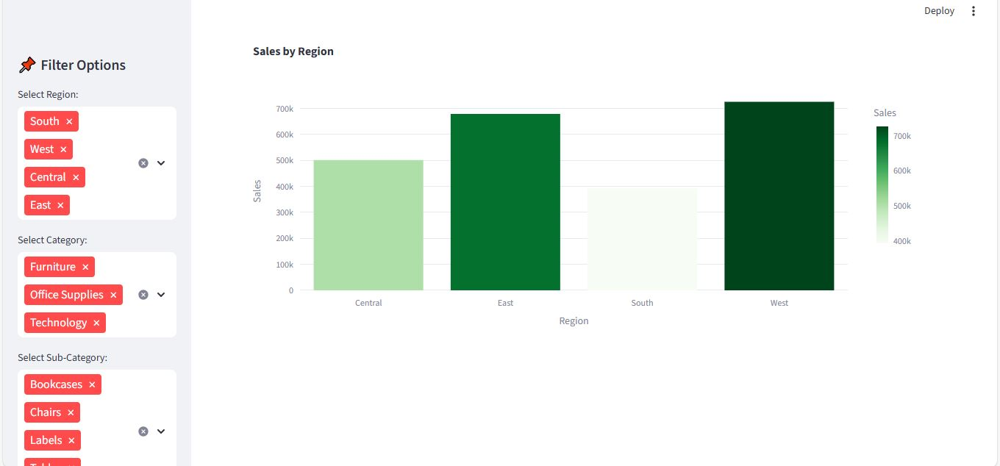

# 📊 Interactive Business Dashboard in Streamlit | Powered by Plotly ⚙️  
      

🚀 The **Interactive Business Dashboard in Streamlit** is a professional data visualization and analytics tool designed to provide dynamic insights into the **Global Superstore** dataset. Built with **Streamlit** and **Plotly**, this project allows users to explore sales and profit metrics interactively — with filters, KPIs, and real-time visualizations. It bridges the gap between data analysts and business users by offering an accessible, engaging, and insightful interface.  

✨ **Key Features:** 📈 Real-time KPI metrics including Total Sales, Total Profit, and Total Orders | 🎯 Interactive sidebar filters for Region, Category, and Sub-category | 📊 Dynamic visualizations using Plotly Express — including bar, line, and pie charts | ⚡ Optimized performance using `@st.cache_data` for faster data loading | 💻 Responsive and minimal dashboard design | 🧩 Simple local deployment using Streamlit CLI.  

🧠 **Tech Stack:**  
- **Language:** Python 🐍  
- **Framework:** Streamlit 🧩  
- **Visualization Library:** Plotly Express 📈  
- **Dataset:** Global Superstore 📦  
- **IDE Recommended:** VS Code / PyCharm 💻  

📁 **Project Structure:**  
- `Task5.py` → Main dashboard application script  
- `Global_Superstore.csv` → Dataset used for visualization  
- `assets/` → Contains dashboard interface preview images  
- `requirements.txt` → List of dependencies  

🧑‍💻 **Author:** [Sayab Arshad](https://github.com/SayabArshad) 👨‍💻  
💼 **Organization:** SoftDesk | DevelopersHub Corporation  
📅 **Version:** 1.0.0  
📜 **License:** MIT License  

🖼️ **Dashboard Interface Previews:**  
  
  
  
  

💡 **About the Project:** This project focuses on building a data-driven, interactive dashboard using Streamlit and Plotly for comprehensive business analytics. The app allows users to filter by region, category, or sub-category while monitoring KPIs like sales, profit, and orders in real time. Visualizations such as bar charts, line charts, and pie charts enable quick and intuitive data interpretation, making it ideal for both analysts and business managers.  

⭐ **Contributions:** Contributions are always appreciated! You can fork this repository, raise issues, or submit pull requests to improve the dashboard. If you found this project valuable, please consider giving it a ⭐ to support continued development.  

📧 **Contact:** For questions, suggestions, or collaboration, feel free to reach out at **sayabarshad789@gmail.com**.  
